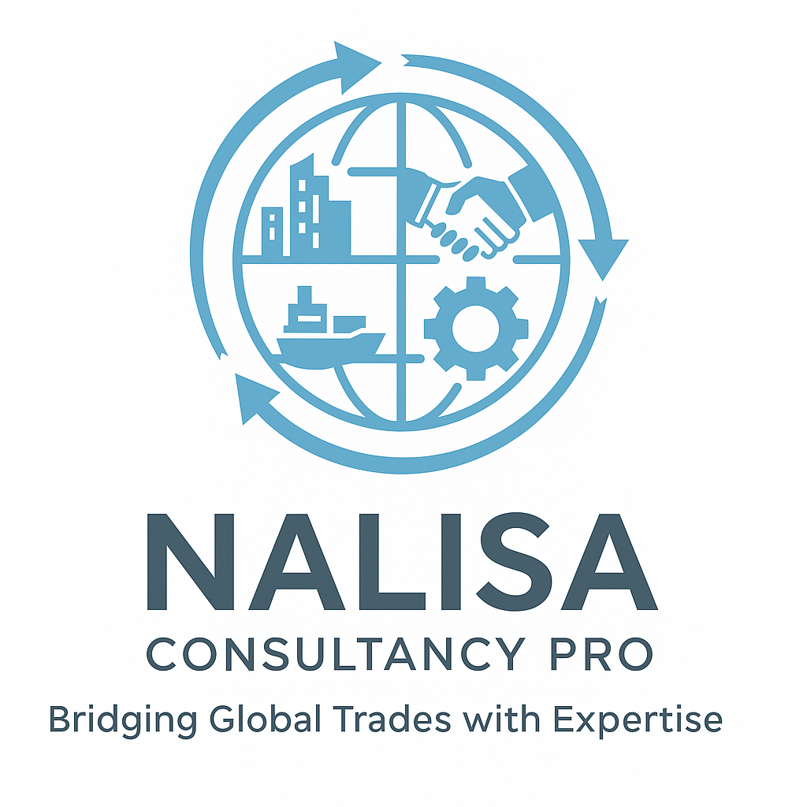

# Nalisa Consultancy Pro Website

  <a href="n.html">
    
    
Visit Nalisa Profile (n.html)

  </a>

**Nalisa Consultancy Pro** is a Zambia-based consultancy platform dedicated to connecting large firms and clients through expert mediation and advisory services across multiple sectors.

---

## Our Services

### Legal Advisory  
We connect you to trusted legal firms for all your corporate or personal legal needs, ensuring reliable legal support for your business or individual requirements.

### IT Solutions  
We mediate between businesses and top-tier IT firms for digital transformation, cybersecurity, system integration, and ongoing IT support.

### Financial Consulting  
Access financial experts who help with planning, auditing, budgeting, and optimizing your financial operations for sustainable growth.

### Construction Services  
We link clients with experienced construction professionals for building projects, civil engineering, renovations, and infrastructure development.

### HR & Recruitment  
Find, assess, and recruit top talent through partnerships with leading HR consultancies, streamlining your hiring process.

### Marketing & Branding  
Boost your brand with creative professionals and strategic marketing services that elevate your business presence locally and beyond.

### Pharmacy  
Connect with licensed pharmacies to access reliable medication supplies and pharmaceutical services tailored to your health needs.

### Health Consultancy  
Receive expert advice and planning from health consultants across various sectors to improve wellbeing and healthcare services.

### Vehicle Diagnosis  
Link with professionals offering computer-based vehicle diagnostics and repair assessments to maintain your fleet or personal vehicles.

### Education & Career Path  
Guidance on academic planning, scholarship opportunities, and career development to empower individuals and institutions for success.

---

## Contact Us

For inquiries or more information about any of our services, please reach out via:

- **Email:** Davidnalisa86@gmail.com  
- **Phone/WhatsApp:** +260 773 281 800  

---

## About This Website

This website showcases our core services with detailed descriptions accessible via clickable images. It features a contact form, live clock, news updates, a calendar, and an interactive chatbot for quick assistance.

---

## Developer

Designed and developed by **Tendai Sande**

---

Thank you for choosing Nalisa Consultancy Pro – your trusted partner for professional consultancy across Zambia.
